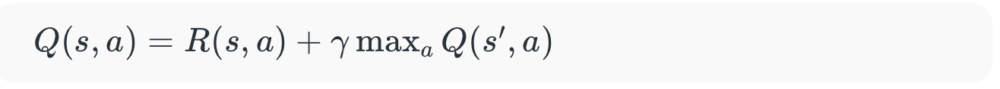
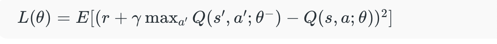

# Q-Learning

## What is Reinforcement Learning?

To learn about Q-learning, we need to know what reinforcement learning is and the steps to take.

> Reinforcement learning is a method to how to learn by interacting with the enviornment and understadning which action give the so called "agent" the best reward

## Q-learning algorithim

This is a model-free architecture. 

Step by step explanation
1. Initialize the state and the Q-table
2. Choose the best action:
    - Either choose a random choice or exploit the good action(The eplison-greedy method and how the exploration probability affects the way that the agent chooses its next move)

3. Execute the action
4. The action is taken and the agent updates the Q-table with its own experience
5. Policy is redifined and cycle repeats

### Ways to define the Q-values

1. Temporal difference
    - This is where we compare the current state and action values with previous ones
2. Bellman's equation (I used this one in the lab experiment and is more commonly used in the world of RL, image below)

## Deep Q-Networks

This combines Q-learning and Deep nueral networks to solve complex decision making problems

> In Q-learning the agent needs to experience everything to get the full Q-table. But in DQNs the NN tries to predict what the total reward(Q-value) will be according to the actions the agent will take

### Architecture of DQNs

1. Nueral Network
    - Tries to approx the Q-value function
2. Experience Replay
    - This is where the DQNs see what happened in the past to replay buffer
3. Target Network
    - Seperate network is used to compute the target Q-values
4. Loss Function

### Training Process

1. Inititalization
    - Initialize replay buffer, main network, and target network
2. Use ϵ-greedy policy to choose what action to take
3. Interact with the env around the agent to collect experiences and store them n replay buffer
4. Sample a mini batch to optimize 
5. Gradually decrease ϵ over time to shift from exploration to exploitation

