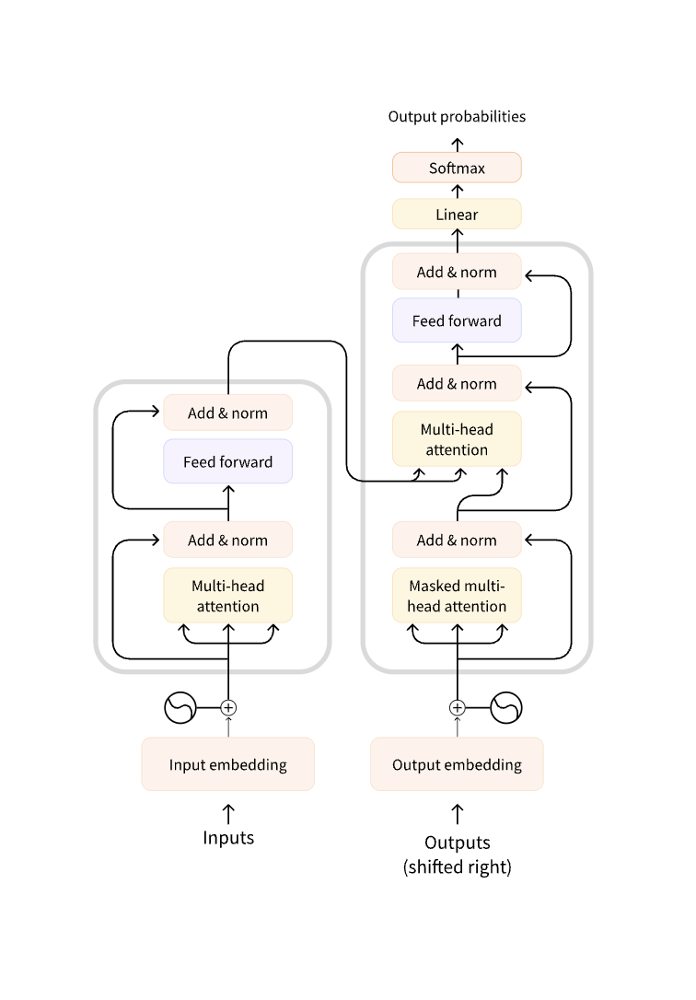

# NLP and Hugging Face

## What is NLP

- Field of ligustics and machine learning
- Understand everything about human language
- not about specific words but overall context

## NLP tasks:
- Classify whole sentences
- Classify whole sentences
- Text gen
- Extract answer from text

## LLMs:
- Revolutionized the world of NLP
- The scale is massive! (Billions of trillions of parameters and data)
- Many general capabilites
- In context learning
- New abilities not explicitly defined by code

> We still have many challenges like context windows, hallucinations, etc.

---

## Transformers in HuggingFace

3 step process when a user uses the `pipeline()` function

1. Text preprocessed into a format the model can use
2. Preprocessed inputs are passed through the model(usually a full transformer architecture with tokenization, encoder, decoder, etc.)
3. Predictions are preprocessed so the user can make sense of them

I showed many ways to use the pipeline function in the `HuggingFace.ipynb` notebook

## Transformers and how they work
### History of transformers
It all started in 2018 when OpenAI released GPT, th first ever pretrained transformer model, used for finetuning on various NLP tasks.

Then the same year the model BERT, another large pretrained model. This one is known to produce better summaries

The final type of model to make its debut is the T5 transformer which focused on multi-task implemation

Since then each model type have increased their parameters and capabilites. To broadly put it every model that has been produced since then are in one of 3 categories:
- GPT-like (auto-regressive)
- BERT-Like (auto-encoding)
- T5-like (Sequence to sequence)
---
### Transformers are language models

> This means that the models have been trained on large amounts of raw-text in "self-supervised" way

Self-supervised learning: objective automatically computed from the inputs, humans not needed. But for specific tasks we need to fine-tune the model(use human labeled data)

**Transformers are very big models! They can cause a bad enviormental and global costs if everyone trains their model from sratch**

---
### Transfer Learning

In this section we will focus on the differences in pretraining and finetuning

**Pretraining**: Trainging a model from sratch
- Weights are randomly initalized and the training starts with no prior knowledge
- Very large data
- Training takes a long time(days to weeks)
- Very large cost to compute

**Finetuning**: Training done after the model has been pretrained.
- This uses pretrained models which reduces time training a model on a lot of data
- Uses less data to get decent reults
- Cost and time in much much lower than if we train from scratch
- Always try to leverage a pretrained model (one close to the task at hand) and fine-tune it

---

### Transformer Architecture

- Encoder: Get inputand compresses it into a representation of the input
- Decoder: Uses encoder representation and other inputs to make target sequence

>Each part can be used independently, depending on the task

Encoder-only models: Good for sentence classification, summarization, and ner
Decoder-only models: Generative tasks
Encoder-decoder/sequence-to-sequence models: Generative tasks that require an input(translation, summarization)

**Attention Layers**

Tells the model to focus on things that are needed to be attended

The key concept here is that a word itself has a meaning, but that meaning is heavily decided by the context, which makes us see the words around it.

Original Architecture:

> This will be continued in the next notes md where we will go deeper in the transformer architecture, learn about GPT, and learn how HF transformers solve NLP tasks.