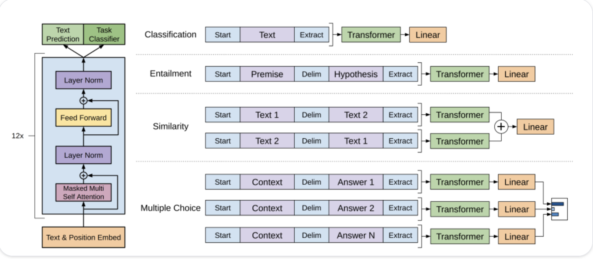

# Transformers in Hugging Face

## How language models are trained

2 ways to train a model:
1. Masked language modeling(MLM): masks some tokens for the model to predict the masked words. This trains to model to understand context and look at words before and after the masked word. (Used by BERT)

2. Casual Language Modeling(CLM): Predicts next token from the previous tokens in the sequence(Used by GPT)

## Types of language models

1. Encoder-only models(BERT): Bidirectional approach to understand context. Used for classification, ner, and question answering

2. Decoder-only models(GPT): Process text from left to right, good for generation tasks

3. Encoder-decoder models: Comine encoder and decoder approaches. Used to get input, understand input, and generate output.

## Model Architectures 

### Text generation

- GPT-2 uses byte pair encoding to tokenize words and embeddings. Positional embeddings are included
- Input embeddings passed through multiple decoder blocks and give out a hidden state
- GPT-2 uses masked self attention
    - GPT-2 cannot attend to previous tokens, it only attends to tokens on the left

### Text classification

BERT is encoder only and attends to words on both sides. This helps the model understand deep connections of the sentence and words around it.

- Word piece tokenization
- Special tokens are given to specific words and sentences to differentiate them from the start of a sentence or a single or pair sentence. 
    - BERT also uses segment embedding to denote whether a token belongs to the first or second sentence in a pair of sentences
- Pretraining:
    - Masked language modeling
    - next-sentence prediction

### Token Classification

This is where we need to assign a label to each token in a sequence

- BERT for NER
- Add a token classification head on top of BERT model
    - Linear layer, accepts hidden states, and performs linear transformation to convert states to logits
    - CEL is calculated and each token to find the most likely label

> This same architecture is used for question answering too!

### Summarization
